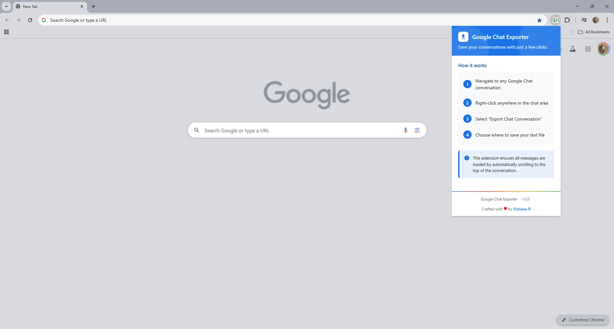
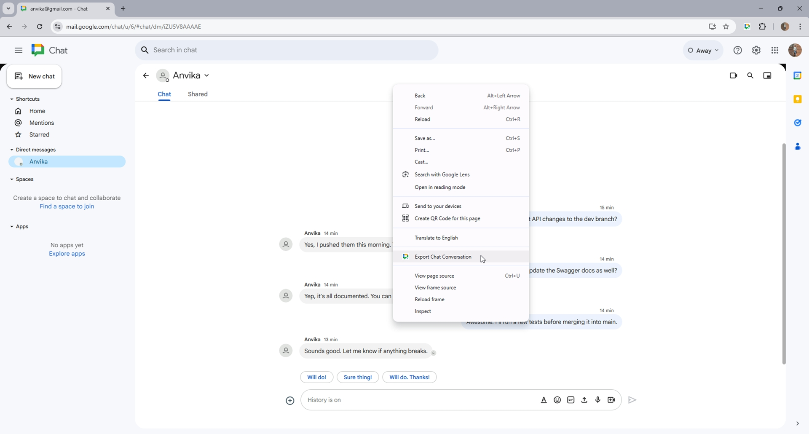

# Google Chat Exporter

A Chrome extension that adds functionality to export Google Chat conversations to text files.

## Features

- Export any Google Chat conversation to a plain text file
- Works with both standalone chat.google.com and Gmail-integrated Google Chat
- Intelligent message extraction that includes:
  - Sender names
  - Timestamps
  - Message content
- Preserves conversation history by scrolling to load older messages
- Simple right-click context menu integration

## Installation

### From Chrome Web Store
1. *Coming soon*

### Manual Installation (Developer Mode)
1. Download or clone this repository to your local machine
2. Open Chrome and navigate to `chrome://extensions/`
3. Enable "Developer mode" at the top right
4. Click "Load unpacked" button
5. Select the folder containing the extension files
6. The extension should now be installed and ready to use

## How to Use

1. Navigate to [Google Chat](https://chat.google.com) or open Chat in Gmail
2. Open the conversation you want to export
3. Right-click anywhere within the chat conversation
4. Select "Export Chat Conversation" from the context menu
5. The extension will:
   - Show a status indicator in the top right
   - Automatically scroll to load older messages
   - Extract all visible messages
   - Download them as a text file named `google-chat-export-YYYY-MM-DD.txt`

## Requirements

- Google Chrome browser (version 88 or higher recommended)
- Access to Google Chat

## Screenshots

| Chrome Extension | Export Chart Option |
|--------------|--------------|
|  |  |

## Troubleshooting

### "Export Chat Conversation" option doesn't appear
- Make sure you're right-clicking inside a Google Chat conversation frame
- Try opening a specific chat first before attempting to export
- Refresh the page and try again

### Export contains incomplete conversation history
- Some very old messages might not load if they're beyond Google Chat's scroll limit
- Try scrolling up manually first to load more history, then use the exporter

### Export fails with no messages found
- Check if you're in an empty conversation
- Try clicking into a different chat and then back to the one you want to export
- Refresh the page and try again

## How It Works

This extension:
1. Identifies the correct frame containing Google Chat content
2. Adds a context menu option when right-clicking in chat
3. When triggered, automatically scrolls up to load older messages
4. Uses multiple parsing approaches to extract message content, senders, and timestamps
5. Formats everything in a clean text file format
6. Downloads the file to your computer

## Privacy

- This extension operates entirely within your browser
- No data is sent to any external servers
- All message extraction happens locally on your computer
- No message content is stored by the extension

## License

See LICENSE file for details
