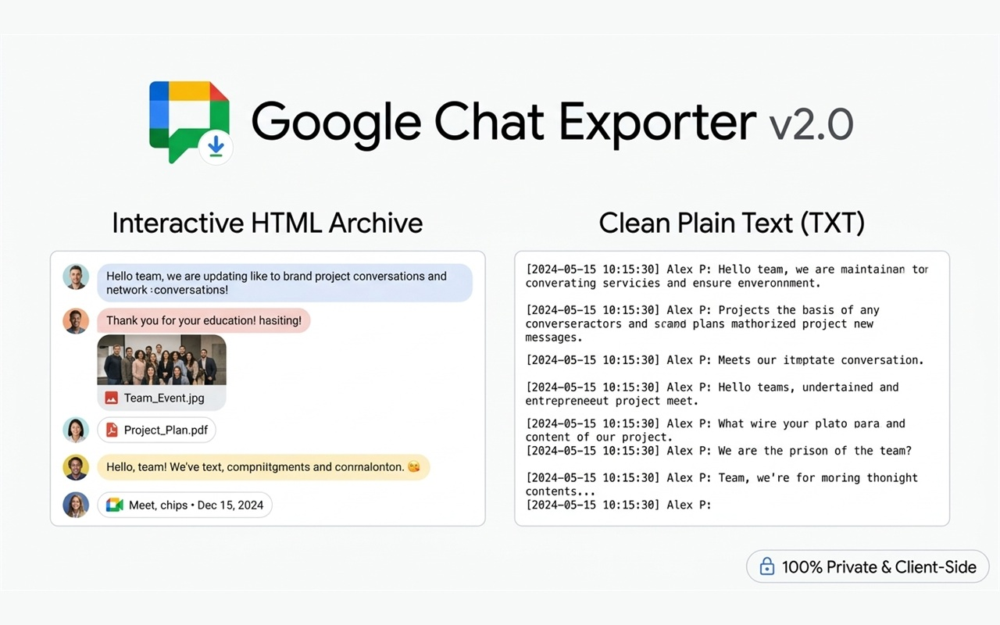
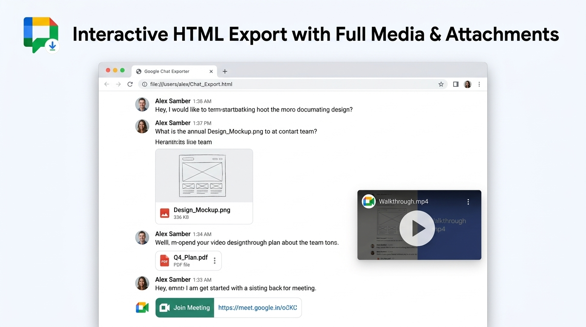

#  Google Chat Exporter

The ultimate, privacy-first browser extension for exporting Google Chat conversations to **Plain Text (TXT)** or **rich HTML with full media attachments (packaged in a ZIP)**.

Works across **Google Chrome, Brave, Microsoft Edge**, standalone PWA windows, and Gmail-embedded Chat.

---

## ✨ Features

- **Dual Export Formats**:
  - **Plain Text (`.txt`)**: Clean, formatted chronological transcript with senders, timestamps, and multi-line formatting preserved.
  - **Structured HTML (`.html + .zip`)**: Complete conversational archive with sender avatars, speech bubbles, embedded images, GIFs, audio notes, video chips, documents, and Google Meet call links.
- **Full Media Extraction**: Automatically downloads photos, GIFs, file attachments, and video previews into a neat `media/` folder inside the ZIP.
- **Adaptive History Loading**: Loads history batch-by-batch and continues as soon as Google Chat adds the next batch.
- **Optional Date Cutoff**: Stop loading once the export reaches a selected “messages since” date.
- **New Since Last Export**: Optional per-conversation checkpoints for TXT, HTML, and HTML with attachments. Each run saves a separate file; the first run establishes a baseline. Checkpoints advance after a completed download. Turn the option off for a full re-export.
- **Concurrent Media Downloads**: Downloads up to four attachments at a time.
- **Bot & Card Message Support**: Extracts card notifications, webhooks, and bot messages (e.g., alert cards) seamlessly.
- **Universal Compatibility**:
  - Standalone Google Chat (`chat.google.com`)
  - Gmail-integrated Google Chat (`mail.google.com`)
  - Progressive Web App (PWA) / standalone window mode (fully tested and working in Brave & Chrome)
- **Two Easy Export Methods**:
  - **Popup UI**: Modern toolbar popup with live conversation detection, format selection, and progress monitoring.
  - **Context Menu**: Right-click anywhere inside a conversation to export as TXT or HTML with media.
- **Live Animated HUD**: Real-time progress indicator showing message count, scroll progress, and media download status.
- **100% Private & Client-Side**: All parsing and ZIP generation happen inside your browser. No external servers, no tracking, zero telemetry.

---

## 📸 Screenshots

| Feature Overview & Popup | Exported HTML Chat View |
| :---: | :---: |
|  |  |

---

## 📥 Installation

### From Chrome Web Store
Install directly from the official store:  
👉 **[Google Chat Exporter on Chrome Web Store](https://chromewebstore.google.com/detail/google-chat-exporter/epemodmmmilflmhgojgonhfcjfjnflgc)**

### Manual Installation (Developer Mode)
1. Clone or download this repository.
2. Open Chrome (or Brave / Edge) and go to `chrome://extensions/`.
3. Toggle **Developer mode** on in the top right.
4. Click **Load unpacked** and select the [`src/`](src) folder.
5. The extension is installed and ready to use!

---

## 🚀 How to Use

1. Navigate to [Google Chat](https://chat.google.com) or Gmail Chat.
2. Click into any direct message or space.
3. Choose either method:
   - **Toolbar Popup**: Click the extension icon in your browser toolbar, select **HTML (with media)** or **TXT**, and click **Export Current Conversation**.
   - **Right-Click**: Right-click anywhere within the chat message area and select **"📄 Export Chat as TXT"** or **"🌐 Export Chat as HTML (with media)"**.
4. The animated status HUD will appear in the bottom-right corner as it scrolls history, extracts messages, and bundles media.
5. Your export file (`.txt` or `.zip`) will download automatically to your Downloads folder.

### Export options

- **Load Full History** traverses the conversation before exporting. Turn it off to export only currently rendered messages.
- **Messages Since** stops history loading after reaching the selected date.
- **New Since Last Export** saves a per-conversation checkpoint and exports only newer messages on subsequent runs. The first run establishes a baseline; TXT, HTML, and HTML-with-media modes use separate checkpoints.
- **Include Media** downloads attachments when HTML is selected.

Each incremental run creates a new file. Keep earlier files to retain the complete archive. Checkpoints are local to the browser profile and advance only after Chrome reports a completed download.

## ⚡ Performance benchmark

Run `npm run benchmark` to compare repeated message extraction with upstream v2 commit `005a22f`. The synthetic workload uses 250 rendered message groups, 160 overlapping collections, alternates execution order, and reports the median of seven rounds.

| Workload | Upstream v2 | v2.1.4 | Speedup | Group parses (old/new) |
|---|---:|---:|---:|---:|
| Stable overlapping viewport | 16.1 ms | 6.4 ms | **2.50×** | 40,000 / 250 |
| 10% of groups changed each pass | 16.0 ms | 8.0 ms | **1.99×** | 40,000 / 4,225 |

Results are representative rather than universal and vary by machine. This benchmark isolates local DOM extraction; Google history-fetch/render latency and attachment downloads are excluded.

---

## 🔒 Privacy & Permissions

- **Zero Data Collection**: No user messages, media, or analytics are collected or sent over the internet.
- **Local Packaging**: HTML and ZIP archives are generated client-side using an offline bundling engine (`jszip`).
- **Minimal Permissions**:
  - `activeTab` & `scripting`: To read the chat DOM when initiated by you.
  - `contextMenus`: For convenient right-click options.
  - `downloads`: To save the exported file to your computer.
  - `storage`: To remember your format preferences locally.

---

## 📄 License

This project is licensed under the GNU General Public License v3.0 - see the [LICENSE](LICENSE) file for details.
